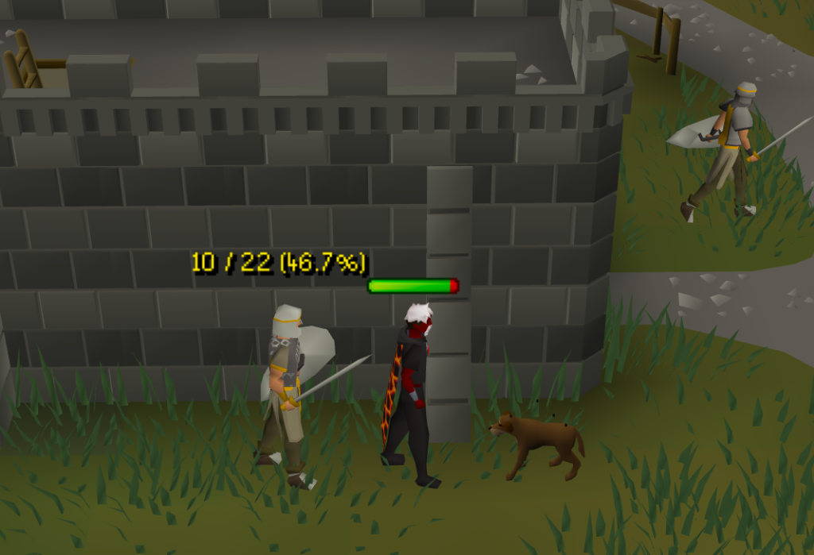

# NPC Health Text

**NPC Health Text** is a simple plugin that shows an NPC's health value in a text or percentage form. I created this originally because I couldn't get other plugins to look or work like this one. 

---

## Features

- **Display Modes**:
  - **HP Value**: Shows exact current and maximum health (e.g. `10 / 22`).
  - **HP Percentage**: Shows health percentage (e.g. `46.7%`).
  - **Both**: Displays both value and percentage (e.g. `10 / 22 (46.7%)`).
- **Dynamic Text Gradient**: Automatically transitions text color from **Green** (100% HP) to **Yellow** (50% HP) to **Red** (0% HP) as health decreases.
- **Persistent Text**: Option to keep displaying health text even after the in-game health bar times out and disappears (until the NPC dies or despawns).
- **NPC Name Filtering**: Display overlays for all NPCs or restrict text to a custom comma-separated list of NPC names.
- **Full Typography & Styling**: Custom font selection (`RuneScape Small`, `RuneScape Bold`, Arial, System Fonts), font sizing, outline/shadow accents, and optional background bubbles.a

---
