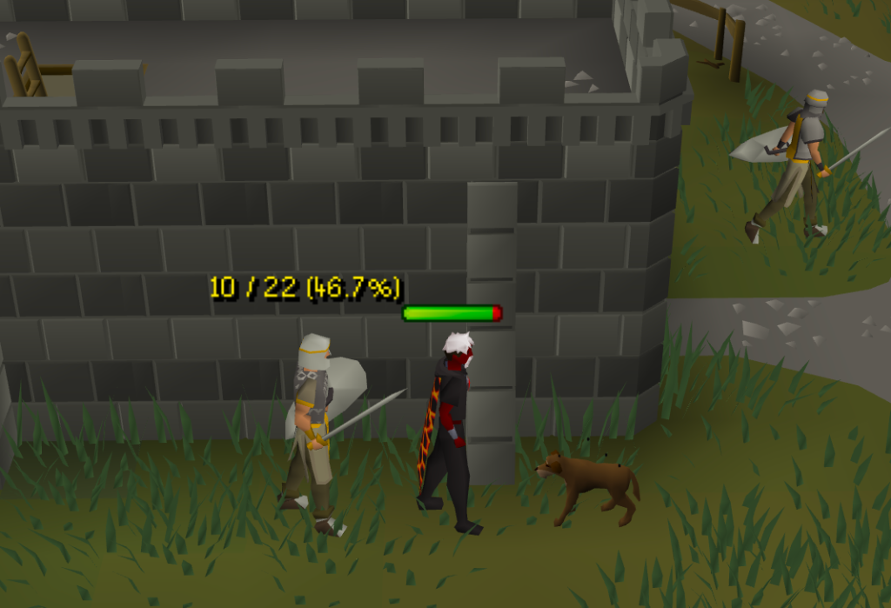

# NPC Health Text

**NPC Health Text** is a simple plugin that shows an NPC's health value in a text or percentage form. I created this originally because I couldn't get other plugins to look or work like this one. 



---

## Features

- **Display Modes**:
  - **HP Value**: Shows exact current and maximum health (e.g. `10 / 22`).
  - **HP Percentage**: Shows health percentage (e.g. `46.7%`).
  - **Both**: Displays both value and percentage (e.g. `10 / 22 (46.7%)`).
- **Dynamic Text Gradient**: Automatically transitions text color from **Green** (100% HP) to **Yellow** (50% HP) to **Red** (0% HP) as health decreases.
- **NPC Position Overrides**: Custom position overrides (`Bottom`, `Middle`, `Top`) per NPC to prevent HP text from obscuring top-screen boss health bars on large enemies.
- **Persistent Text**: Option to keep displaying health text even after the in-game health bar times out and disappears (until the NPC dies or despawns).
- **NPC Name Filtering**: Use the whitelist / blacklist to limit what NPCs have the overlay.
- **Full Typography & Styling**: Custom font selection (`RuneScape Small`, `RuneScape Bold`, Arial, System Fonts), font sizing, outline/shadow accents, and optional background bubbles.

---

## Recommended Raid Boss Overrides

When fighting large raid bosses, setting the overlay position to **Bottom** prevents HP text from rendering high above the boss or behind the top-screen Boss HP bar.

```text
Great Olm*:Bottom, Tekton:Bottom, Ice Demon:Bottom, Vanguard*:Bottom, Vasa Nistirio:Bottom, Muttadile*:Bottom, Skeletal Mystic*:Bottom, The Maiden of Sugadinti:Bottom, Pestilent Bloat:Bottom, Sotetseg:Bottom, Xarpus:Bottom, Verzik Vitur*:Bottom, Nylocas Vasilias:Bottom, Ba-Ba:Bottom, Zebak:Bottom, Kephri:Bottom, Akkha*:Bottom, *Warden*:Bottom
```
*(Note: Unspecified positions default to `Bottom`, so `Great Olm*` works identically to `Great Olm*:Bottom`)*
